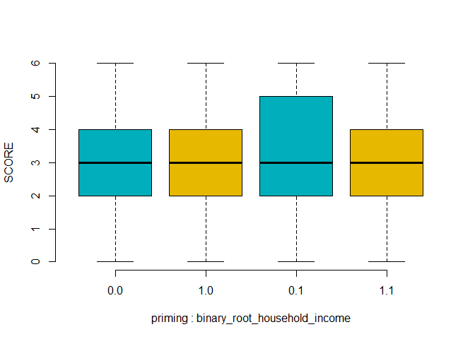

                  <!-- NOTE -->
<!-- KNITTING ONLY WORKS IN HTML FOR NOW.  -->

## R Markdown

This is a document demonstrating how the analysis and results section of the replication paper will be conducted. Everything is adapted from the original Mani et al. (2013) paper.

Three variables are added: the total_iq_score, a simple sum of the number of correct answers in the iq test, and a priming, which identifies if the participant saw the high (coded as 1) or low (coded as 0) priming. The last variable is whether the participant had a household income, divided by the square root of the household size, above (1) or below (0) the median income level (divided by household size) of the sample. This was used in the original study as a proxy for if the participants were "poor" or "rich". 

In the original paper the main analysis of interest for the shopping mall study was a two-way ANOVA 
so this is also used here, aov()-function is used. 

## Temporary outline notes 

## Introduction
We tried to replicate experiment 4 from study 1 in mani et al (poverty impedes cognitive function) – the shopping mall study where people read each scenario and then responded to a IQ test. 
## Methods
We increased the sample size to 500 and collected via prolific.co. Different from original where they were collected in person in a shopping mall. 
Only americans. Good spread of income level. 
### Tests 
Not ravens matrices but very similar – Hagen matrices (SOURCE HERE). Six rounds increasing difficulty. We note that this is different to original where they got 3 rounds randomly selected. 

## Results
We found no effects in an anova. 
<!-- html table generated in R 4.1.2 by xtable 1.8-4 package -->
<!-- Tue Mar 01 12:28:23 2022 -->
<table border=1>
<tr> <th>  </th> <th> Df </th> <th> Sum Sq </th> <th> Mean Sq </th> <th> F value </th> <th> Pr(&gt;F) </th>  </tr>
  <tr> <td> priming </td> <td align="right"> 1 </td> <td align="right"> 3.86 </td> <td align="right"> 3.86 </td> <td align="right"> 1.46 </td> <td align="right"> 0.2276 </td> </tr>
  <tr> <td> binary_root_household_income </td> <td align="right"> 1 </td> <td align="right"> 5.96 </td> <td align="right"> 5.96 </td> <td align="right"> 2.26 </td> <td align="right"> 0.1336 </td> </tr>
  <tr> <td> priming:binary_root_household_income </td> <td align="right"> 1 </td> <td align="right"> 2.77 </td> <td align="right"> 2.77 </td> <td align="right"> 1.05 </td> <td align="right"> 0.3062 </td> </tr>
  <tr> <td> Residuals </td> <td align="right"> 496 </td> <td align="right"> 1310.26 </td> <td align="right"> 2.64 </td> <td align="right">  </td> <td align="right">  </td> </tr>
   </table>
<!-- -->

## Discussion
Perhaps something wrong with priming, perhaps it does not work. But it did in the original. Also - Bickel et al. (2016) managed to get effects with a somewhat similar priming (negative income shock in a short narrative text, participants asked to simply think about it for a while). This was on temporal discounting though, and not the IQ-effect described here. IQ-effect is probably not there. 

