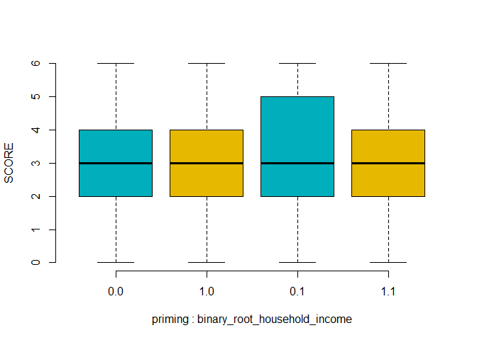

<!-- KNITTING ONLY WORKS IN HTML FOR NOW.  -->

## Introduction

Over the past ten years, scarcity has been investigated in terms of how it changes people's way they think and behave.
Scarcity relates to having less than people feel they need and can be experienced in various contexts -- lack of money, food, time or even company of others [@mullainathan2013].
Previous research suggested that not having enough resources -- money -- can create a cognitive load which leads to decreased cognitive performance [@mani_poverty_2013].
Thus, scarcity may lead to a greater engagement and focus on particular problems and in turn lead to neglect of other issues.
For example, poorer people tend to make worse financial decisions which can be because they focus on solving their financial problems that they are facing in that moment, disregarding the ones they might run into later [@shah_consequences_2012].
In the following paper, we focus on one particular scarcity context -- money.
@mani_poverty_2013 argued that being poorer may impose the cognitive load which hinders cognitive capacity.
Researchers devised a laboratory experiment that took place in local shopping mall.
Participants were asked about their annual household income, were induced with thoughts about their possible financial hardships by reading hypothetical financial scenarios (vignettes) and performed Raven's IQ test (three trials) and Stroop test to measure cognitive functions.
They were randomly assigned to either "hard" financial condition (scenarios that included relatively high costs) or "easy" financial condition (scenarios that included relatively low costs).
@mani2013 used a median split to assign participants to income groups: poor and rich.
Those poorer scored lower in cognitive function tasks under the "hard" condition than those who were richer.
The authors suggest the effects should not be limited only to economic resources.
Rather, they argued that this is a general way of human resource judgment.
However, some question the reliability of presented claims.
@wicherts2013 argued that using median split to analyse the income was unnecessary as such practice is not only linked to lower power and possible loss of individual differences information but also it is unable to indicate nonlinear relations (MacCallum et al, 2002).
By performing linear regression analysis on the original data using a mean-centred income they investigated interactions between the income and financial scenario.
There was no significant interaction found.
Additionally, @wicherts2013 raised some concerns about ceiling effects, most likely caused by short measures of cognitive functions.

More recently, @odonnell2021 attempted to replicate the @mani_poverty_2013 study.
They indicated it was largely underpowered (only 6%).
Replication had higher power (32%), but effect sizes were almost negligible, comparing to the original (Cohen's d between 0.88 and 0.94).
@odonnell2021 estimated that to obtain 80% power sample size would have to reach 13,500 participants -- Mani et al's.
(2013) sample size was 101.
Replication of the @mani_poverty_2013 study is important for few reasons.
To our knowledge, the only replication [see @odonnell2021] failed to corroborate the original results. As the effects demonstrated in the shopping mall study has been central to the scarcity mindset theory as a whole, several replication attempts are warranted.
A successful replication could provide some ways forward in understanding how people treat general resources in the area of judgement and decision making psychology.
Further, if the claims are true, they could have important implications for policies regarding poverty, e.g. programs that aim to bring people out of the poverty would have to be redesigned to meet participants needs.
This is why, we hope to replicate the results of the shopping mall experiment in @mani_poverty_2013.
We aimed to demonstrate IQ reduction among poor people presented with the large expense scenarios.
Thus, their IQ scores should be the lowest among all tested groups.
We followed the procedure, materials and statistical analysis used in the original study.
Our sample was similar, but bigger to increase statistical power.
However, we used a different IQ test and omitted Stroop test.
Lastly, due to Covid-19 pandemics, we were forced to conduct the experiment online.
Despite those differences, we believed they did not have a large impact on the overall results.

In the original paper the main analysis of interest for the shopping mall study was a two-way ANOVA so this is also used here, aov()-function is used.

## Temporary outline notes

### Methods 

##### Respondents
We aimed to keep everything as close as possible to the original, but the pandemic and several cost considerations forced some changes. We had to collect respondents via prolific.co instead of recruited people in person in shopping malls. This would have been unsafe during the pandemic. However, this meant that we had the possibility to recruit only people living in the United States. Had we done the experiment in person we would have recruited Swedish people. We paid our participants £2.50 via Prolific. This resulted in an average hourly pay of around £11.60. Seeing as we recruited participants online we had no control of their environment during the experiment, but we asked that they completed the online experiment on a desktop computer or laptop and not smartphone or tablet. This was to be more sure that the IQ-test was displayed correctly and looked as similar as possible for every respondent. We used a pre-screening feature in Prolific to make sure we got a spread of income levels from £16,000 to £149,000 annual income. We also asked to only receive car owners since one of the priming vignettes asked people to imagine a car related cost. 

##### Tests 
Not ravens matrices but very similar -- Hagen matrices (SOURCE HERE).
Six rounds increasing difficulty.
We note that this is different to original where they got 3 rounds randomly selected.

##### Priming materials
<!-- Everything from supp materials - increased costs a bit because of inflation over the last 10 years. DESCRIBE HOW MUCH  -->
<!-- Displayed one on each page - asked them to write a little bit were applicable, or choose from alternatives for some questions -->
<!-- Describe randomization, could not randomize fully because of qualtrics problems   -->

### Results
<!-- People did write things in the alternatives, so they seemed to be engaging with the material. The answers made sense and were thorough.  -->
Good spread of income level. <!-- show with stats/numbers here -->

We found no effects in an anova.

<!-- html table generated in R 4.1.2 by xtable 1.8-4 package -->
<!-- Wed Mar 30 11:23:30 2022 -->
<table border=1>
<tr> <th>  </th> <th> Df </th> <th> Sum Sq </th> <th> Mean Sq </th> <th> F value </th> <th> Pr(&gt;F) </th>  </tr>
  <tr> <td> priming </td> <td align="right"> 1 </td> <td align="right"> 3.86 </td> <td align="right"> 3.86 </td> <td align="right"> 1.46 </td> <td align="right"> 0.2276 </td> </tr>
  <tr> <td> binary_root_household_income </td> <td align="right"> 1 </td> <td align="right"> 5.96 </td> <td align="right"> 5.96 </td> <td align="right"> 2.26 </td> <td align="right"> 0.1336 </td> </tr>
  <tr> <td> priming:binary_root_household_income </td> <td align="right"> 1 </td> <td align="right"> 2.77 </td> <td align="right"> 2.77 </td> <td align="right"> 1.05 </td> <td align="right"> 0.3062 </td> </tr>
  <tr> <td> Residuals </td> <td align="right"> 496 </td> <td align="right"> 1310.26 </td> <td align="right"> 2.64 </td> <td align="right">  </td> <td align="right">  </td> </tr>
   </table>

<!-- -->

### Discussion

Perhaps something wrong with priming, perhaps it does not work.
But it did in the original.
Also - Bickel et al. (2016) managed to get effects with a somewhat similar priming (negative income shock in a short narrative text, participants asked to simply think about it for a while).
This was on temporal discounting though, and not the IQ-effect described here.
IQ-effect is probably not there.

<!-- did the very high payment possibly influence resluts? -->
<!-- no experiment control because they were at home --> 

### References
