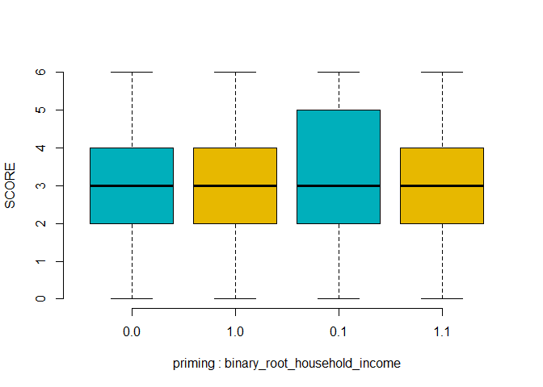

<!-- html table generated in R 4.1.2 by xtable 1.8-4 package -->
<!-- Tue Mar 01 12:23:20 2022 -->
<table border=1>
<tr> <th>  </th> <th> Df </th> <th> Sum Sq </th> <th> Mean Sq </th> <th> F value </th> <th> Pr(&gt;F) </th>  </tr>
  <tr> <td> priming </td> <td align="right"> 1 </td> <td align="right"> 3.86 </td> <td align="right"> 3.86 </td> <td align="right"> 1.46 </td> <td align="right"> 0.2276 </td> </tr>
  <tr> <td> binary_root_household_income </td> <td align="right"> 1 </td> <td align="right"> 5.96 </td> <td align="right"> 5.96 </td> <td align="right"> 2.26 </td> <td align="right"> 0.1336 </td> </tr>
  <tr> <td> priming:binary_root_household_income </td> <td align="right"> 1 </td> <td align="right"> 2.77 </td> <td align="right"> 2.77 </td> <td align="right"> 1.05 </td> <td align="right"> 0.3062 </td> </tr>
  <tr> <td> Residuals </td> <td align="right"> 496 </td> <td align="right"> 1310.26 </td> <td align="right"> 2.64 </td> <td align="right">  </td> <td align="right">  </td> </tr>
   </table>
<!-- -->
